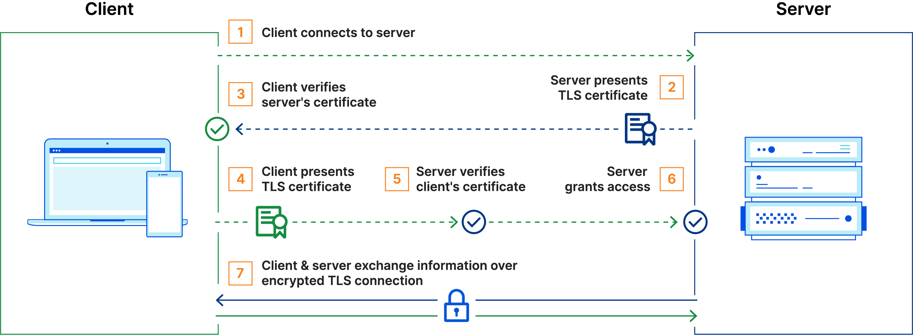
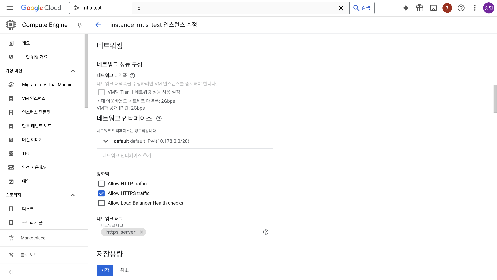
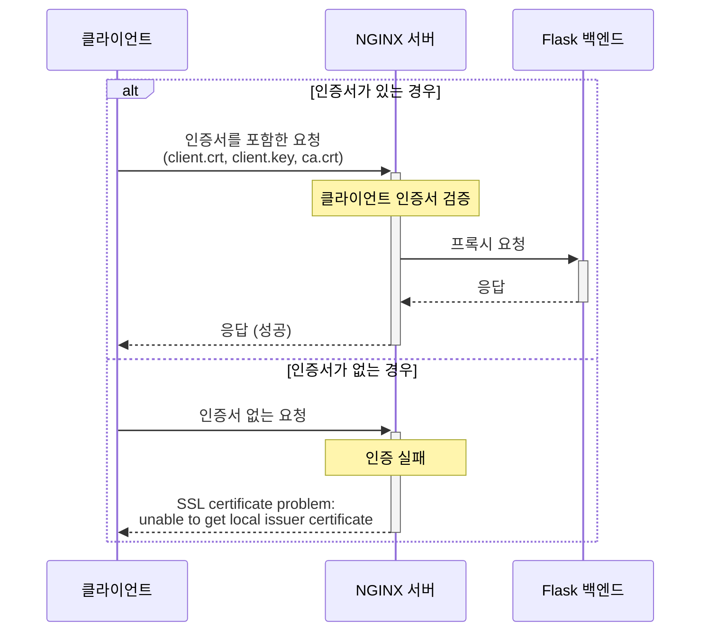

안녕하세요, 원큐 오더 PL 남승현입니다.

현재 저희 팀은 결제 프로세스 구현을 위해 PG사, 카드사, 앱카드사, 은행 서버를 개발하고 있어요.
이러한 금융 시스템에서 데이터 보안은 그 무엇보다 중요한 요소이며, 특히 결제 정보와 같은 민감한 데이터를 처리할 때는 안전한 통신 방식의 구현이 필수적이죠.

## 왜 mTLS가 필요한가요?



금융 거래에서는 단순한 암호화를 넘어, 통신하는 양측의 신원을 확실하게 검증하는 양방향 인증이 필요해요.
특히 한국에서는 결제 시스템의 보안에 대한 법적 요구사항이 엄격하며, 이는 다음과 같은 법률과 규정에 명시되어 있어요.

- **개인정보 보호법(PIPA)**: 카드 번호와 같은 고유 식별 정보의 전송 시 암호화를 포함한 보안 조치를 의무화하고 있어요.
- **전자금융거래법(EFTA)**: PG사, 카드사, 은행 간 통신을 포함한 모든 전자금융거래에서 안전성을 보장하기 위한 조치를 요구해요.
- **PCI DSS(Payment Card Industry Data Security Standard)**: 카드 결제를 처리하는 모든 기관은 카드 소지자 데이터 전송 및 저장 시 암호화를 필수로 요구하고 있어요.

이러한 요구사항을 충족시키기 위해 단순한 HTTPS 통신을 넘어서, 클라이언트와 서버가 서로의 신원을 확인하는 mTLS(mutual TLS) 방식이 금융 시스템에서 널리 사용되고 있어요.
mTLS는 한쪽의 인증서만 확인하는 일반 TLS와 달리, 통신하는 양측 모두가 인증서를 제출하고 검증하기 때문에 보안성이 훨씬 더 강화되죠.

이 블로그 포스트에서는 실제 결제 시스템에서 활용할 수 있는 mTLS 통신 환경을 NGINX를 통해 구축하는 방법을 상세히 안내해 드릴게요.
이 가이드를 통해 안전한 API 통신 시스템을 구현하는 데 도움이 되었으면 좋겠어요.

## 주요 용어 설명

- **CA (Certificate Authority)**: 인증서를 발급하고 서명하는 신뢰할 수 있는 기관이에요. 클라이언트나 서버의 신원을 보증해주죠. 이 가이드에서는 테스트 용도로 직접 CA를 만들어 사용할 거예요.
- **CSR (Certificate Signing Request)**: 인증서를 발급받기 위해 요청하는 데이터예요. 인증을 받고자 하는 주체(예: 서버)는 자신의 공개키, 조직 정보 등을 담아 CSR을 생성하고,
  이를 CA에 제출해요.
- **인증서 서명 (Certificate Signing)**: CA가 인증 요청(CSR)의 내용을 검토한 후, 자신의 **비밀키**로 서명해서 인증서에 신뢰성을 부여하는 과정이에요. 이 서명을 통해 인증서의 위변조 여부를 검증할 수 있어요.
- **mTLS (mutual TLS)**: 클라이언트와 서버가 **서로의 인증서**를 검증해 신뢰를 확인하는 **양방향 TLS 인증 방식**이에요. 일반 TLS는 서버만 인증하지만, mTLS는 클라이언트도 인증받아요.
- **키 페어 (Key Pair)**: 서로 연관된 **공개키와 비밀키 한 쌍**이에요. 일반적으로 **비밀키로 서명**하고, 그 서명을 **공개키로 검증**해요. 인증서에는 공개키가 들어가 있고, 비밀키는 절대 외부에 노출되지 않아요.
- **NGINX**: 가볍고 성능이 뛰어난 웹 서버이자 리버스 프록시로, 많은 기업에서 API 게이트웨이 역할을 담당해요. 보안 설정이 간편하고 효율적이어서 mTLS 구현에 자주 활용되죠.

이번 포스트에서는 Google Cloud Platform(GCP) 인스턴스에서 `test.woorifisa.site` 도메인을 사용해 mTLS(Mutual TLS) 통신을 설정하고,
NGINX를 통해 백엔드 서비스를 띄우는 과정을 상세히 설명해드리려고 해요. mTLS는 내부 API 통신이나 금융 시스템 같은 보안이 중요한 환경에서 특히 유용하답니다!

## 실습 진행 환경

저는 아래와 같은 환경에서 실습을 진행했어요.

- **GCP 인스턴스**: Ubuntu 24.10 운영체제 (`test.woorifisa.site`에 매핑된 공인 IP를 가진 인스턴스)
- **도메인**: `test.woorifisa.site` (GCP 인스턴스의 공인 IP와 연결된 DNS A 레코드 설정 필요)
- **로컬 환경**: MacBook (인증서 생성용)
- **도구**:
    - OpenSSL (MacBook에 기본 설치됨)
    - NGINX (GCP 인스턴스에 설치)
    - curl (테스트용)
    - SSH 액세스 (GCP 인스턴스 접속용)

## 1. 로컬에서 인증서 생성하기 (MacBook)

이제 본격적으로 시작해볼게요! 가장 먼저 할 일은 인증서 생성이에요. 인증서는 mTLS 통신의 핵심이라고 할 수 있어요.
서버와 클라이언트 모두 인증서가 필요하며, 이들은 모두 신뢰할 수 있는 CA의 서명을 받아야 해요.

### 1.1. 디렉토리 생성

먼저 인증서 파일들을 관리할 디렉토리를 만들어볼게요.

```bash
mkdir -p ./certs
```

### 1.2. CA 인증서 생성

모든 인증서 과정의 시작점인 CA(인증 기관)을 만들어볼게요.
실제 환경에서는 `Let's Encrypt` 같은 공인 CA를 사용하지만, 테스트 환경에서는 직접 CA를 만들어도 괜찮아요.

1. CA 키를 먼저 생성해볼게요. 이 키는 CA의 비밀키로, 다른 인증서에 서명할 때 사용돼요.

   ```bash
   cd ./certs
   openssl genpkey -algorithm RSA -out ca.key
   ```

2. 이제 인증서 서명에 사용할 CA 인증서를 생성해요. 이 인증서는 CA의 공개키를 포함하며, 유효기간은 1년으로 설정했어요.
   ```bash
   cd ./certs
   openssl req -new -x509 -key ca.key -out ca.crt -days 365 -subj "/CN=TestCA"
   ```
   이렇게 생성된 CA 인증서는 나중에 클라이언트와 서버 모두가 신뢰할 기준이 돼요.

### 1.3. 서버 인증서 생성

다음으로 서버 인증서를 만들어볼게요.
서버 인증서는 클라이언트가 접속했을 때 서버의 신원을 증명하는 용도로 사용돼요. HTTPS 웹사이트에 접속할 때 보는 자물쇠 아이콘과 관련된 부분이죠!

1. 서버에서 사용할 키(비밀키)를 생성해요.

   ```bash
   cd ./certs
   openssl genpkey -algorithm RSA -out server.key
   ```

   이 키는 절대 외부에 노출되면 안 되는 서버의 비밀 정보예요.

2. 서버의 인증서 서명 요청(CSR)을 생성할게요. 이것은 "저는 test.woorifisa.site라는 도메인의 서버입니다"라고 CA에게 말하는 것과 같아요.

   ```bash
   cd ./certs
   openssl req -new -key server.key -out server.csr -subj "/CN=test.woorifisa.site"
   ```

3. 방금 만든 CA로 서버 인증서에 서명해요. 이 과정을 통해 CA가 "이 서버는 진짜 test.woorifisa.site가 맞아요"라고 보증하는 거죠.
   ```bash
   cd ./certs
   openssl x509 -req -in server.csr -CA ca.crt -CAkey ca.key -CAcreateserial -out server.crt -days 365
   ```

### 1.4. 클라이언트 인증서 생성

마지막으로 클라이언트 인증서를 만들어볼게요. 일반 HTTPS와 다르게 mTLS에서는 클라이언트도 자신의 신원을 증명해야 하기 때문에 인증서가 필요해요. 이 부분이 mTLS의 핵심이죠!

1. 클라이언트용 키를 만들어볼게요.

   ```bash
   cd ./certs
   openssl genpkey -algorithm RSA -out client.key
   ```

2. 클라이언트의 CSR을 생성해요. 여기서는 식별을 위해 'client.woorifisa.site'라는 이름을 사용했어요.

   ```bash
   cd ./certs
   openssl req -new -key client.key -out client.csr -subj "/CN=client.woorifisa.site"
   ```

3. CA로 클라이언트 인증서에도 서명해요. 이제 서버는 이 인증서를 통해 클라이언트가 신뢰할 수 있는 주체인지 확인할 수 있어요.
   ```bash
   cd ./certs
   openssl x509 -req -in client.csr -CA ca.crt -CAkey ca.key -CAcreateserial -out client.crt -days 365
   ```

여기까지 완료하셨다면, 인증서 생성은 모두 끝났어요! 이제 `./certs` 디렉토리에는 CA, 서버, 클라이언트 각각의 인증서와 키가 준비되어 있을 거예요.

## 2. GCP 인스턴스 설정하기

이제 인증서를 준비했으니, 실제 서버 환경을 구성해볼게요. GCP 인스턴스에 접속해서 필요한 설정들을 해볼 거예요.

### 2.1. GCP 인스턴스 접속하기

먼저 GCP 인스턴스에 접속해야 해요. Google Cloud 콘솔에서 SSH를 사용하거나, gcloud 명령어를 통해 접속할 수 있어요.

GCP Console에서 인스턴스의 공인 IP를 확인해 아래 명령어를 사용해 SSH로 접속해보세요.

```bash
ssh [USERNAME]@[INSTANCE_IP]
```

혹은 GCP Console에서 인스턴스 이름과 존을 확인한 후, 아래 명령어를 사용해 SSH로 접속해주세요.

```bash
gcloud compute ssh [INSTANCE_NAME] --zone [ZONE]
```

예를 들면: `gcloud compute ssh instance-mtls-test --zone asia-northeast3-c` 이렇게 입력하시면 돼요.

### 2.2. 필수 도구 설치하기

NGINX는 경량화된 고성능 웹 서버로, 리버스 프록시 기능이 특히 뛰어나요. mTLS 설정도 간편하게 할 수 있어 API 게이트웨이로 자주 활용되죠. 그럼 NGINX를 설치해볼게요.

1. 패키지 목록을 최신화하고 NGINX를 설치해요.

   ```bash
   sudo apt-get update -y
   sudo apt-get upgrade -y
   sudo apt-get install -y nginx
   ```

   이 명령어들은 시스템 패키지를 최신 상태로 업데이트하고, NGINX 웹 서버를 설치해요.

2. NGINX가 제대로 설치됐는지 확인해주세요.
   ```bash
   nginx -v
   ```
   버전 정보가 출력된다면 설치가 잘 된 거예요!

### 2.3. 인증서 업로드하기

로컬에서 생성한 인증서를 GCP 인스턴스로 옮겨야 해요. 서버 인증서와 CA 인증서가 필요한데, 클라이언트 인증서는 API를 호출하는 측에서 사용할 거예요.

1. GCP 인스턴스에 인증서를 저장할 디렉토리부터 만들어볼게요.

   ```bash
   sudo mkdir -p /mtls-demo/certs
   ```

2. MacBook에서 생성한 인증서 파일들을 GCP 인스턴스로 전송해볼게요.

   아래 명령어를 사용해 인증서 파일들을 GCP 인스턴스로 복사해주세요.

   ```bash
   sudo scp -i ~/.ssh/[YOUR_SSH_KEY] ./certs/{ca.crt,server.crt,server.key} [USERNAME]@[INSTANCE_IP]:/tmp/
   ```

   혹은 gcloud 명령어를 사용해도 돼요.

   ```bash
   sudo gcloud compute scp ./certs/{ca.crt,server.crt,server.key} [INSTANCE_NAME]:/tmp/ --zone [ZONE]
   ```

3. 파일이 제대로 전송됐는지 확인해볼까요?
   
   ```bash
   ls /tmp
   ```
   GCP 인스턴스에 정상적으로 전송되었다면 `/tmp` 경로에 `ca.crt`, `server.crt`, `server.key` 파일들이 보일 거예요.

4. 이제 인증서 파일들을 `/mtls-demo/certs` 디렉토리로 이동해볼게요.

   ```bash
   sudo mv /tmp/{ca.crt,server.crt,server.key} /mtls-demo/certs/
   ```

### 2.4. 방화벽 설정하기

mTLS는 HTTPS를 사용하기 때문에 443 포트가 열려 있어야 해요. GCP 인스턴스의 방화벽 규칙을 설정해볼게요.



GCP 콘솔에서 해당 인스턴스를 선택하고 `수정` 버튼을 클릭한 다음, 방화벽 섹션에서 `HTTPS 트래픽 허용` 체크박스를 선택해주세요. 이렇게 하면 외부에서 443 포트로 접근할 수 있게 돼요.

## 3. 백엔드 서비스 설정하기

NGINX는 리버스 프록시 역할을 할 텐데요, 실제로 요청을 처리할 간단한 백엔드 서비스가 필요해요. 여기서는 Python의 Flask를 사용해 간단한 API 서버를 만들어볼게요.

### 3.1. Flask 설치 및 설정하기

1. Python과 Flask 패키지를 설치해볼게요.

   ```bash
   sudo apt-get install -y python3 python3-pip python3-flask
   ```

2. 간단한 API 서버 코드를 작성할게요.

   ```bash
   sudo mkdir -p /mtls-demo/backend
   sudo vi /mtls-demo/backend/app.py
   ```

3. 에디터가 열리면 아래 내용을 입력해주세요. 이 코드는 루트 경로('/')로 요청이 오면 인사말을 반환하는 아주 간단한 웹 서버예요.

   ```python
   from flask import Flask
   app = Flask(__name__)

   @app.route('/')
   def hello():
       return 'Hello from test.woorifisa.site backend!'

   if __name__ == '__main__':
       app.run(host='0.0.0.0', port=8080)
   ```

4. 이제 Flask 서버를 백그라운드로 실행해볼게요.
   ```bash
   nohup python3 /mtls-demo/backend/app.py &
   ```
   `nohup`과 `&`를 사용하면 서버가 백그라운드에서 계속 실행돼요.

### 3.2. Flask 앱 테스트하기

백엔드 서버가 제대로 실행됐는지 확인해볼게요.

```bash
curl http://localhost:8080
```

모든 것이 정상이라면, `Hello from test.woorifisa.site backend!`라는 메시지가 보일 거예요. 이제 내부적으로 API 서버가 잘 작동하고 있네요!

## 4. NGINX로 mTLS 설정하기

이제 가장 중요한 부분이에요! NGINX를 설정해서 mTLS를 활성화하고, 백엔드 서버로 요청을 프록시해볼 거예요. NGINX는 mTLS 처리와 백엔드 라우팅을 모두 담당하게 될 거예요.

### 4.1. NGINX 설정 파일 작성하기

1. 먼저 NGINX 설정 파일을 저장할 디렉토리를 만들어볼게요.

   ```bash
   sudo mkdir -p /mtls-demo/nginx
   ```

2. 이제 설정 파일을 작성해볼게요

   ```bash
   sudo vi /mtls-demo/nginx/nginx.conf
   ```

3. 다음 내용을 입력해주세요. 이 설정은 mTLS를 활성화하고 백엔드 서비스로 요청을 전달해요.

   ```nginx
   worker_processes auto;  # NGINX 워커 프로세스 수를 자동으로 설정

   events {
       worker_connections 1024;  # 각 워커 프로세스가 처리할 수 있는 최대 연결 수
   }

   http {
       ssl_session_cache shared:SSL:10m;  # SSL 세션 캐시 설정
       ssl_session_timeout 10m;  # SSL 세션 타임아웃 설정

       server {
           listen 443 ssl;  # 443 포트(HTTPS)로 들어오는 요청을 수신
           server_name test.woorifisa.site;  # 도메인 이름 설정

           # 서버 인증서 및 키 설정 (서버가 자신을 클라이언트에게 증명)
           ssl_certificate /mtls-demo/certs/server.crt;
           ssl_certificate_key /mtls-demo/certs/server.key;

           # 클라이언트 인증서 검증 설정 (mTLS의 핵심부분!)
           ssl_client_certificate /mtls-demo/certs/ca.crt;  # 클라이언트 인증서를 검증할 CA 인증서
           ssl_verify_client on;  # 클라이언트 인증서 검증 활성화
           ssl_protocols TLSv1.2 TLSv1.3;  # 허용할 TLS 프로토콜 버전
           ssl_ciphers HIGH:!aNULL:!MD5;  # 허용할 암호화 알고리즘

           # 로그 설정
           access_log /mtls-demo/nginx/access.log;
           error_log /mtls-demo/nginx/error.log;

           # 백엔드 프록시 설정 (들어온 요청을 Flask 앱으로 전달)
           location / {
               proxy_pass http://localhost:8080;  # 요청을 Flask 서버로 전달
               proxy_set_header Host $host;  # 원본 Host 헤더 유지
               proxy_set_header X-Real-IP $remote_addr;  # 실제 클라이언트 IP 전달
               proxy_set_header X-Forwarded-For $proxy_add_x_forwarded_for;
               proxy_set_header X-Forwarded-Proto $scheme;
           }
       }
   }
   ```

   이 설정에서 중요한 부분은 SSL 인증서 관련 설정들이에요. `ssl_certificate`와 `ssl_certificate_key`는 서버 자신의 인증서 정보를 설정하고,
   `ssl_client_certificate`와 `ssl_verify_client on`은 클라이언트 인증서를 검증하도록 지시하는 부분이에요. 이 두 가지 설정이 있어야 양방향 인증(mTLS)이 가능해지죠!

### 4.2. NGINX 실행하기

설정 파일을 작성했으니, 이제 NGINX를 실행해볼게요.

1. 먼저 설정 파일에 오류가 없는지 테스트해볼게요.

   ```bash
   sudo nginx -t -c /mtls-demo/nginx/nginx.conf
   ```

   `syntax is ok`와 `test is successful`이 출력되면 설정에 문제가 없는 거예요.

2. 혹시 이미 실행 중인 NGINX가 있다면 종료해볼게요.

   ```bash
   sudo pkill nginx
   ```

3. 이제 우리가 작성한 설정으로 NGINX를 시작해볼게요.

   ```bash
   sudo nginx -c /mtls-demo/nginx/nginx.conf
   ```

   이 명령어가 오류 없이 실행되면, NGINX가 성공적으로 시작된 거예요! 이제 mTLS가 설정된 웹 서버가 443 포트에서 요청을 기다리고 있을 거예요.

## 5. mTLS 통신 테스트하기



자, 이제 모든 설정이 완료되었어요! 실제로 mTLS 통신이 잘 작동하는지 테스트해볼 차례예요. 클라이언트 인증서를 사용한 경우와 사용하지 않은 경우를 모두 테스트해볼게요.

### 5.1. 클라이언트 인증서로 테스트하기

MacBook(로컬 환경)에서 클라이언트 인증서를 사용해 테스트해볼게요:

```bash
curl --cert ./certs/client.crt --key ./certs/client.key --cacert ./certs/ca.crt https://test.woorifisa.site
```

이 명령어는 curl에게 세 가지 인증 관련 파일을 제공해요.

- `--cert`: 클라이언트 인증서 (서버가 클라이언트를 인증하는 데 사용)
- `--key`: 클라이언트 비밀키 (클라이언트가 소유권을 증명하는 데 사용)
- `--cacert`: CA 인증서 (서버 인증서를 검증하는 데 사용)

모든 게 잘 설정되었다면, `Hello from test.woorifisa.site backend!` 메시지가 보일 거예요! 이것은 mTLS 통신이 성공적으로 이루어졌다는 의미예요.

### 5.2. 인증서 없이 테스트하기 (실패 예상)

이번에는 클라이언트 인증서 없이 요청해볼게요.

```bash
curl https://test.woorifisa.site
```

mTLS가 제대로 적용되었다면, 이 요청은 실패해야 해요. NGINX는 클라이언트 인증서 검증에 실패하고 다음과 같은 오류를 반환할 거예요.
`SSL certificate problem: unable to get local issuer certificate`

이 오류는 정상이에요! mTLS가 제대로 동작하고 있다는 증거랍니다. 클라이언트가 유효한 인증서를 제공하지 않으면 API 접근이 차단되는 거죠.

## 6. 팀원들과 공유하기

mTLS 설정이 완료되었으니, 이제 팀원들도 API에 안전하게 접근할 수 있도록 필요한 정보를 공유해요.

- **인증서 파일**: 팀원들에게 클라이언트 인증서 세트(`client.crt`, `client.key`, `ca.crt`)를 안전하게 전달해주세요. 암호화된 ZIP 파일이나 비밀번호로 보호된 채널을 사용하면
  좋아요.

- **API 호출 방법**: 팀원들에게 다음과 같은 curl 명령어를 공유해주세요.

  ```bash
  curl --cert client.crt --key client.key --cacert ca.crt https://test.woorifisa.site
  ```

- **서버 정보**: GCP 인스턴스의 공인 IP와 도메인(`test.woorifisa.site`) 정보도 함께 공유해주세요.

인증서 파일은 비밀키를 포함하고 있기 때문에, 공유할 때 보안에 특히 신경 써주세요. 비밀키가 노출되면 보안이 심각하게 저하될 수 있어요!

## 7. 문제 해결하기

혹시 설정 중에 문제가 발생하셨나요? 다음 부분들을 확인해보세요:

- **NGINX 에러가 발생했다면**: `/mtls-demo/nginx/error.log` 파일을 확인해보세요. 대부분의 문제는 로그에 자세히 기록되어 있어요.

- **방화벽 관련 문제**: GCP 방화벽 규칙에서 443 포트가 허용되어 있는지 다시 한번 확인해주세요. 인스턴스 설정에서 `HTTPS 트래픽 허용` 체크박스가 활성화되어 있어야 해요.

- **DNS 설정 문제**: 도메인이 올바른 IP로 연결되어 있는지 확인해볼까요?

  ```bash
  dig test.woorifisa.site
  ```

  이 명령어의 결과에 인스턴스의 공인 IP가 나오는지 확인해보세요.

- **Flask 앱이 응답하지 않는다면**: 프로세스가 실행 중인지 확인해볼까요?
  ```bash
  ps aux | grep python3
  ```
  프로세스가 보이지 않는다면, Flask 앱을 다시 시작해주세요.

## 마무리하며

이렇게 해서 mTLS 설정이 모두 완료되었어요! 이제 클라이언트와 서버 간의 안전한 양방향 인증이 가능해졌고, API 통신이 훨씬 더 안전해졌답니다.

mTLS는 높은 보안이 요구되는 시스템에서 매우 유용한 기술이에요. 내부 API 통신, 금융 서비스, 의료 정보 시스템 등 데이터가 민감한 환경에서 특히 중요하게 활용된답니다.

혹시 추가 질문이나 어려움이 있으시다면 언제든 문의해주세요!

## 참고 자료
- [Cloudflare - 상호 TLS(mTLS)란 무엇일까요?
](https://www.cloudflare.com/ko-kr/learning/access-management/what-is-mutual-tls/)