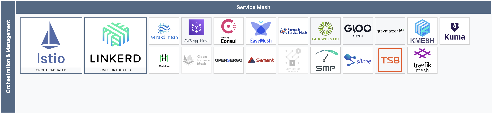
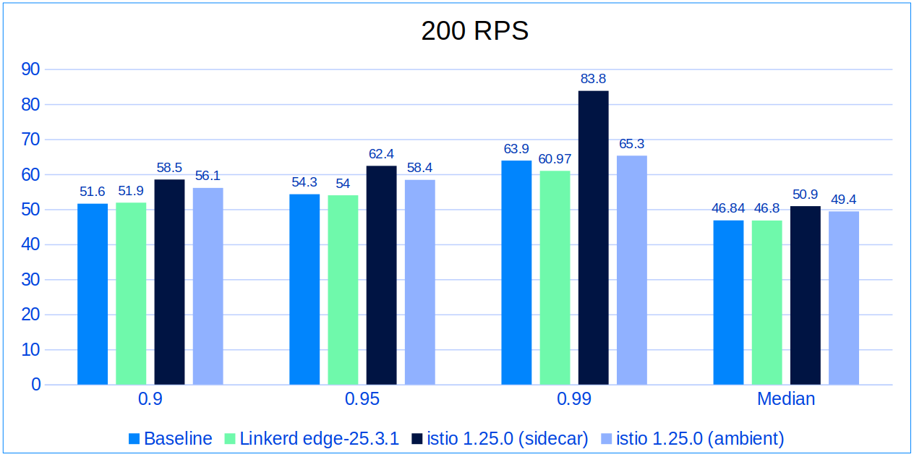
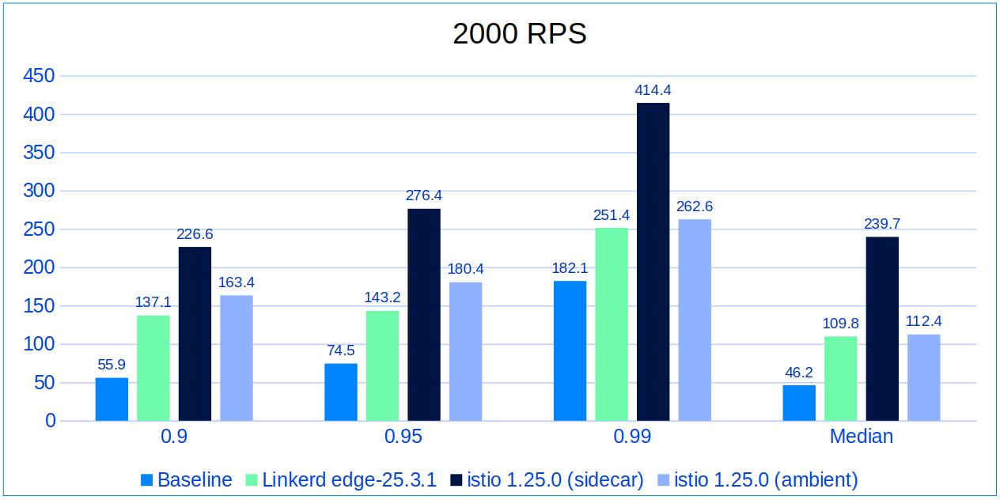
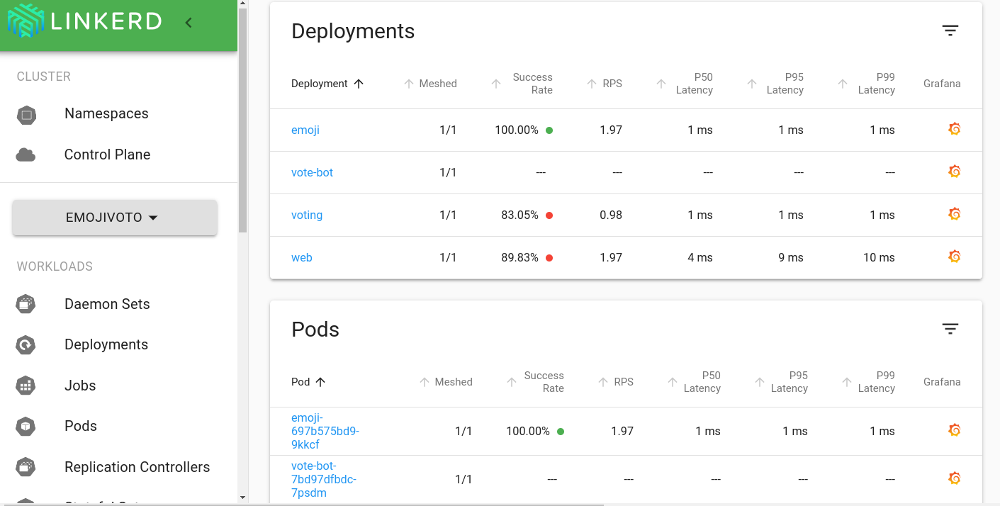

안녕하세요, 원큐 오더 PL 남승현입니다.

이전 포스팅에서는 [NGINX를 사용한 mTLS 설정 가이드](../2025-05-20/mtls-api-communication-setup-guide.md)에 대해 다루었는데요,
오늘은 저희 팀이 보다 효율적이고 안전한 인프라를 구축하기 위해 선택한 **Kubernetes**와 **Linkerd**에 대해 이야기해보려고 해요.

## 기존 인프라 설계의 문제점

현재 저희 팀은 `원큐오더`, `PG사`, `앱카드사`, `카드사`, `은행` 서비스를 개발하고 있어요.
이 모든 서비스들은 실제 금융 환경을 반영하기 위해 서로 다른 VPC에 배포하기로 결정했었죠.

각 VPC는 아래와 같은 구조로 설계되었는데요,

**Public 서브넷:**

- Grafana
- Application Load Balancer
- NAT Gateway
- (클라이언트가 있는 서비스의 경우) 클라이언트 애플리케이션 + NGINX + Prometheus

**Private 서브넷:**

- 서버 애플리케이션
- NGINX
- Prometheus

이러한 구조에서는 각 서비스마다 독립적인 인프라 구성 요소들이 필요했고, 결과적으로 **42개**의 관리 포인트가 생기게 되었어요.
이는 다음과 같은 문제점을 야기했죠:

1. **운영 부담 증가**: 각 서비스의 인프라를 개별적으로 관리해야 해요
2. **비용 증가**: 중복된 리소스로 인한 불필요한 비용이 발생해요
3. **보안 관리 복잡성**: 여러 VPC에 걸친 보안 설정 관리가 어려워요

이러한 문제들을 해결하기 위해 저희 팀은 인프라 설계를 재검토하기로 했어요.

## 새로운 인프라 설계

42개의 관리 포인트를 줄이기 위해 저희는 **컨테이너 오케스트레이션**과 **서비스 메시 기술**을 도입하기로 했어요.
이러한 기술들을 활용하면 구조를 단순화하면서도 보안과 운영 효율성을 높일 수 있을 것 같았거든요.


_Kubernetes 클러스터 아키텍처 (출처: Kubernetes 공식 문서)_

저희는 여러 솔루션을 비교 검토한 후에 최종적으로 **Kubernetes**와 **Linkerd**를 조합해서 사용하기로 결정했어요. 이제부터 저희가 해당 기술 스택을 선택한 이유와 그 과정에서의 고민들을
공유해볼게요.

## 컨테이너 오케스트레이션 솔루션 비교

새로운 인프라 설계를 위해 가장 먼저 컨테이너 오케스트레이션 솔루션을 선택해야 했어요. **여러 서비스를 효율적으로 관리하고 배포하기 위한 도구가 필요**했거든요. 저희가 중요하게 생각한 기준은 클라우드 중립성,
안정성, 유연성, 그리고 자동화 기능이었답니다.

여러 솔루션을 검토한 결과, 다음과 같은 옵션들을 주요 후보로 고려했어요:

### 1. Kubernetes

- **장점**: 오픈소스로 클라우드 중립적이고, 풍부한 생태계와 커뮤니티 지원이 있어요. 강력한 오케스트레이션 기능과 선언적 상태 관리가 가능해요.
- **단점**: 초기 설정이 복잡하고 학습 곡선이 가파를 수 있어요.

### 2. Amazon ECS (Elastic Container Service)

- **장점**: AWS 서비스들과 잘 연동되고, 설정도 비교적 간단해요.
- **단점**: Kubernetes만큼 유연하지 않고 AWS에만 묶여있다는 단점이 있어요.
  특히 저희는 GCP 크레딧으로 초기 테스트를 하고 있었는데, ECS는 AWS에서만 사용 가능하니까 테스트 단계부터 비용이 발생할 수 있었죠.

### 3. Docker Compose

- **장점**: 개발자들에게 친숙하고 로컬 환경에서 설정하기가 정말 쉬워요.
- **단점**: 실제 운영 환경에서 필요한 고가용성이나 자동 확장, 장애 복구 같은 기능들이 부족해요.

## Kubernetes를 선택한 이유

여러 컨테이너 오케스트레이션 솔루션을 비교한 결과, 저희는 **Kubernetes**를 선택하게 되었어요.
Kubernetes를 선택한 이유는 다음과 같아요:

1. **클라우드 중립성**: 저희는 GCP에서 테스트하고 AWS로 이전할 계획이었어요. Kubernetes는 클라우드 제공업체에 종속되지 않아서, GCP에서 시작해 AWS로 이전하는 데 유리했죠.

2. **논리적 격리 구현**: 실제 금융 환경에서는 서비스 간 명확한 경계가 필수적인데, Kubernetes의 네임스페이스를 활용하면 물리적으로 분리된 VPC 없이도 논리적 격리를 구현할 수 있었어요.

3. **확장성과 성숙도**: Kubernetes는 CNCF의 첫 번째 졸업 프로젝트로, 안정성이 검증되었고 대규모 커뮤니티 지원을 받고 있어요.
   또한, 다양한 오픈소스 솔루션과의 통합이 용이해요.

4. **DevOps 자동화**: 배포 파이프라인과 GitOps 방식의 인프라 관리를 통해, 인프라 변경사항을 코드로 관리하고 자동화된 배포를 구현하기에 최적이었어요.

## Kubernetes를 사용해 얻은 이점

Kubernetes를 도입한 후 저희가 얻은 주요 이점은 다음과 같아요:

### 1. 중복 인프라 요소 제거와 관리 포인트 감소

Kubernetes를 도입하면서 생긴 가장 큰 장점은 **중복되는 인프라 구성 요소들을 크게 줄일 수 있었다**는 점이에요.

기존에는 각 서비스마다 다음과 같은 인프라 요소들이 중복으로 필요했어요:

- NAT 게이트웨이 (각 VPC마다)
- 모니터링 환경 (Prometheus, Grafana)
- 보안 그룹 및 네트워크 ACL 관리

하지만 Kubernetes를 사용하니 이 모든 것이 크게 간소화되었죠:

- 하나의 VPC와 단일 NAT 게이트웨이만 필요해졌어요 (**4개의 NAT 게이트웨이를 줄일 수 있었어요**)
- monitoring namespace에 중앙 집중식 Prometheus와 Grafana를 배포해 모든 서비스의 메트릭을 한 곳에서 수집하고 시각화할 수 있게 되었어요 (**4개의 모니터링 환경을 줄일 수 있었어요**)
- 서비스 간 통신 규칙을 네트워크 정책으로 일관되게 관리할 수 있게 되었어요

특히 퍼블릭 클라우드에서는 NAT 게이트웨이와 로드밸런서 같은 관리형 서비스에 상당한 비용이 들어가는데, 이런 요소들을 공유함으로써 인프라 비용을 크게 절감할 수 있었어요!

### 2. 자원 활용 효율성 향상

Kubernetes를 도입하면서 생긴 또다른 장점은 **자원 활용 효율성**이에요.

기존 인프라 구성에서는 각 서비스마다 독립적인 인스턴스가 필요했으나, Kubernetes를 도입함으로써 자원을 훨씬 효율적으로 활용할 수 있게 되었어요.
실제로 저희 환경에서 2core 4GB 인스턴스에서의 자원 사용량을 분석해보면 그 효율성을 명확히 확인할 수 있답니다:

**(클라이언트 인스턴스) 컨테이너별 자원 사용량:**

```
CONTAINER ID   NAME      CPU %     MEM USAGE / LIMIT     MEM %     NET I/O         BLOCK I/O   PIDS
88d8d4ce44e7   client    0.00%     41.82MiB / 3.821GiB   1.07%     283kB / 2.4MB   0B / 0B     11
```

**(클라이언트 인스턴스) 시스템 전체 자원 사용량:**

```
top - 02:14:45 up 3 days, 36 min,  3 users,  load average: 0.00, 0.00, 0.00
Tasks: 119 total,   1 running, 118 sleeping,   0 stopped,   0 zombie
%Cpu(s):  0.0 us,  0.2 sy,  0.0 ni, 99.8 id,  0.0 wa,  0.0 hi,  0.0 si,  0.0 st
MiB Mem :   3912.7 total,    351.1 free,    883.6 used,   2996.7 buff/cache
MiB Swap:      0.0 total,      0.0 free,      0.0 used.   3029.1 avail Mem
```

**(서버 인스턴스) 컨테이너별 자원 사용량:**

```
CONTAINER ID   NAME      CPU %     MEM USAGE / LIMIT     MEM %     NET I/O           BLOCK I/O        PIDS
bba148d0c486   server    0.14%     271.9MiB / 3.821GiB   6.95%     1.02MB / 1.09MB   135kB / 64.6MB   39
```

**(서버 인스턴스) 시스템 전체 자원 사용량:**

```
top - 02:11:37 up 11 days, 22:42,  5 users,  load average: 0.07, 0.04, 0.01
Tasks: 127 total,   1 running, 126 sleeping,   0 stopped,   0 zombie
top - 02:12:59 up 11 days, 22:43,  5 users,  load average: 0.06, 0.04, 0.00
Tasks: 124 total,   1 running, 123 sleeping,   0 stopped,   0 zombie
%Cpu(s):  0.2 us,  0.2 sy,  0.0 ni, 99.7 id,  0.0 wa,  0.0 hi,  0.0 si,  0.0 st
MiB Mem :   3912.7 total,   1779.3 free,   1492.3 used,   1007.9 buff/cache
MiB Swap:      0.0 total,      0.0 free,      0.0 used.   2420.4 avail Mem
```

현재 저희는 2core 4GB 인스턴스를 총 8대(클라이언트 3대, 서버 5대) 운영 중인데,
이를 환산하면, **약 15.96vCPU와 9.72GB 이상의 메모리가 낭비**되고 있다는 것을 알 수 있어요.

하지만 Kubernetes를 도입하면서 이러한 **여유 자원을 다른 서비스의 컨테이너에 동적으로 할당**할 수 있게 되었고,
그 결과 기존 인프라에서 발생할 수 있었던 자원 낭비를 효과적으로 줄일 수 있었어요.

## Service Mesh 솔루션 비교

Kubernetes 환경을 구축한 후, 다음으로 해결해야 할 중요한 과제는 **서비스 간 통신 보안**이었어요.

기존에는 NGINX를 사용해 mTLS를 설정하려고 했는데, 이는 각 인스턴스마다 별도로 설정해야 했고, 관리 포인트가 늘어나는 단점이 있었어요. 그래서 저희는 **Service Mesh** 솔루션을 도입하기로
결정했고, 안정적인 운영과 보안성을 고려해 CNCF의 졸업 프로젝트 중에서 선택하기로 했어요.

> "Graduated and incubating projects are considered stable and are used successfully in production environments."
>
> _[CNCF Graduated](https://www.cncf.io/projects/)_

CNCF 졸업 프로젝트 중에서 저희가 검토한 Service Mesh 솔루션은 **Istio**와 **Linkerd**였어요. 두 솔루션 모두 강력한 기능을 제공하지만, 각각의 장단점이 있었죠.



### 1. Istio

- **장점**: 매우 풍부한 기능 세트와 트래픽 관리, 보안 정책, 관찰성 등을 제공해요. 다양한 배포 옵션과 세밀한 설정이 가능하며, Envoy 프록시 기반의 강력한 성능을 제공해요.
- **단점**: 상당한 리소스를 소비하고, 복잡한 아키텍처와 설정으로 학습 곡선이 가파르며, 초기 설정과 운영 부담이 커요.

### 2. Linkerd

- **장점**: 매우 가벼운 리소스 사용량과 간단한 설치, 직관적인 설정이 가능해요. Rust로 작성된 자체 프록시로 오버헤드가 적고, 기본 mTLS 설정이 되어 간편해요.
- **단점**: Istio보다 일부 고급 기능이 제한적이고, 커뮤니티 규모가 상대적으로 작아요.

## Linkerd를 선택한 이유

면밀한 검토 끝에, 저희는 Linkerd를 선택했어요. 결정적인 이유는 다음과 같았죠:

1. **리소스 효율성**: 저희는 컴퓨팅 자원을 최대한 비즈니스 로직 처리에 할당하고 싶었어요.

   저희가 검토한 [Dominik Táskai의 2025년 벤치마크 자료](https://linkerd.io/2025/04/24/linkerd-vs-ambient-mesh-2025-benchmarks/)에 따르면,
   다양한 RPS(Request Per Second) 조건에서 Linkerd는 Istio (sidecar 방식) 대비 P99 레이턴시(99번째 백분위수 지연 시간)가 현저히 낮게 측정되었어요.

   
   
   

   이러한 결과는 Linkerd가 높은 트래픽 상황에서도 효율적으로 작동할 수 있음을 시사하며, 저희 시스템의 리소스 효율성 목표와 부합했어요.

2. **운영 단순성**: 저희 팀은 서비스 메시를 처음 도입하는 상황이었고, Linkerd의 간단한 설치와 직관적인 운영 방식이 매력적이었어요.

3. **핵심 기능 집중**: 필요했던 mTLS, 트래픽 제어, 기본적인 모니터링 기능은 Linkerd에서 모두 제공했고, 오히려 불필요한 복잡성 없이 핵심 기능에 집중된 점이 장점으로 다가왔어요.

## Linkerd를 도입해 얻은 이점

Linkerd를 도입한 후 저희가 얻은 주요 이점은 다음과 같아요:

### 1. mTLS 자동화 및 관리 포인트 감소

Linkerd는 모든 서비스 간 통신을 자동으로 mTLS로 암호화해줘요.
이를 통해 각 서비스마다 별도로 보안 설정을 하지 않아도 되어, 보안 관리가 훨씬 간편해졌어요.

또한, 각 서비스의 보안 설정과 트래픽 관리를 Linkerd에서 일괄적으로 처리할 수 있어, 기존 **8개의 관리 포인트를 1개로 줄일 수 있었어요.** (Nginx 설정 파일을 관리할 필요가 없어졌으니깐요!)

### 2. 실시간 모니터링

Linkerd는 서비스 간 통신을 실시간으로 모니터링할 수 있는 기능을 제공해요.
각 서비스의 요청 성공률, 지연 시간, 처리량 등을 쉽게 확인할 수 있어, 문제 발생 시 빠르게 대처할 수 있어요.


_Linkerd 대시보드 (출처: [Linkerd 공식 문서](https://linkerd.io/2-edge/features/dashboard/))_

## 결론 및 향후 계획

Kubernetes와 Linkerd Service Mesh를 도입함으로써 저희는 인프라 관리 포인트를 크게 줄일 수 있었어요.
이는 운영 효율성을 크게 높이고, 저희 팀이 서비스 개발에 집중할 수 있게 해주었답니다!

궁금한 점이 있으시면 언제든지 문의해주세요!

## 참고 자료

- [Kubernetes 공식 문서](https://kubernetes.io/docs/home/)
- [ECS 공식 문서](https://docs.aws.amazon.com/AmazonECS/latest/developerguide/what-is-ecs.html)
- [Docker Compose 공식 문서](https://docs.docker.com/compose/)
- [Linkerd 공식 문서](https://linkerd.io/docs/)
- [Istio 공식 문서](https://istio.io/latest/docs/)
- [CNCF 졸업 프로젝트](https://www.cncf.io/projects/)
- [CNCF Landscape](https://landscape.cncf.io/)
- [Benchmarking Linkerd and Istio: 2021 redux](https://www.cncf.io/blog/2021/12/17/benchmarking-linkerd-and-istio-2021-redux/)
- [Linkerd vs Ambient Mesh: 2025 Benchmarks](https://linkerd.io/2025/04/24/linkerd-vs-istio-benchmark/)
