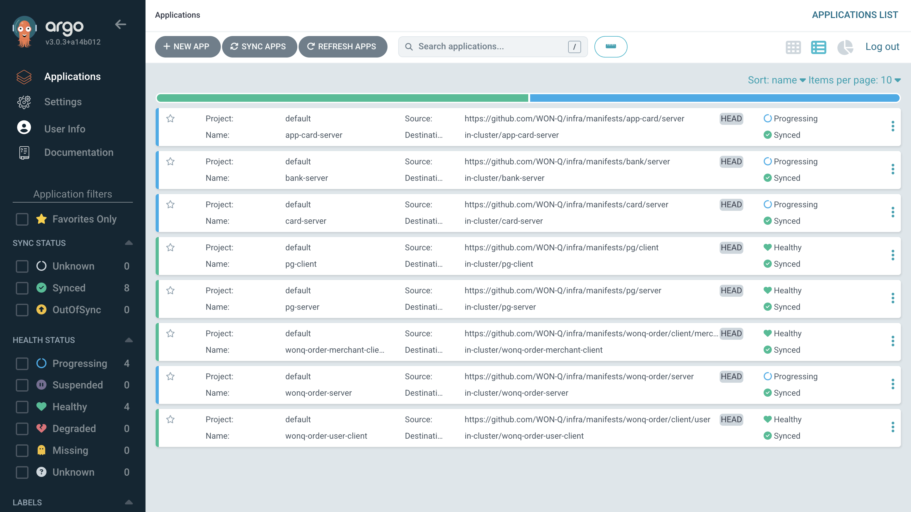
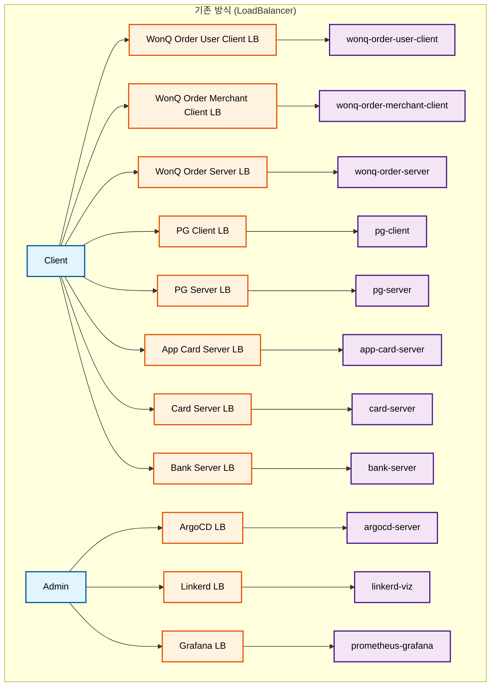
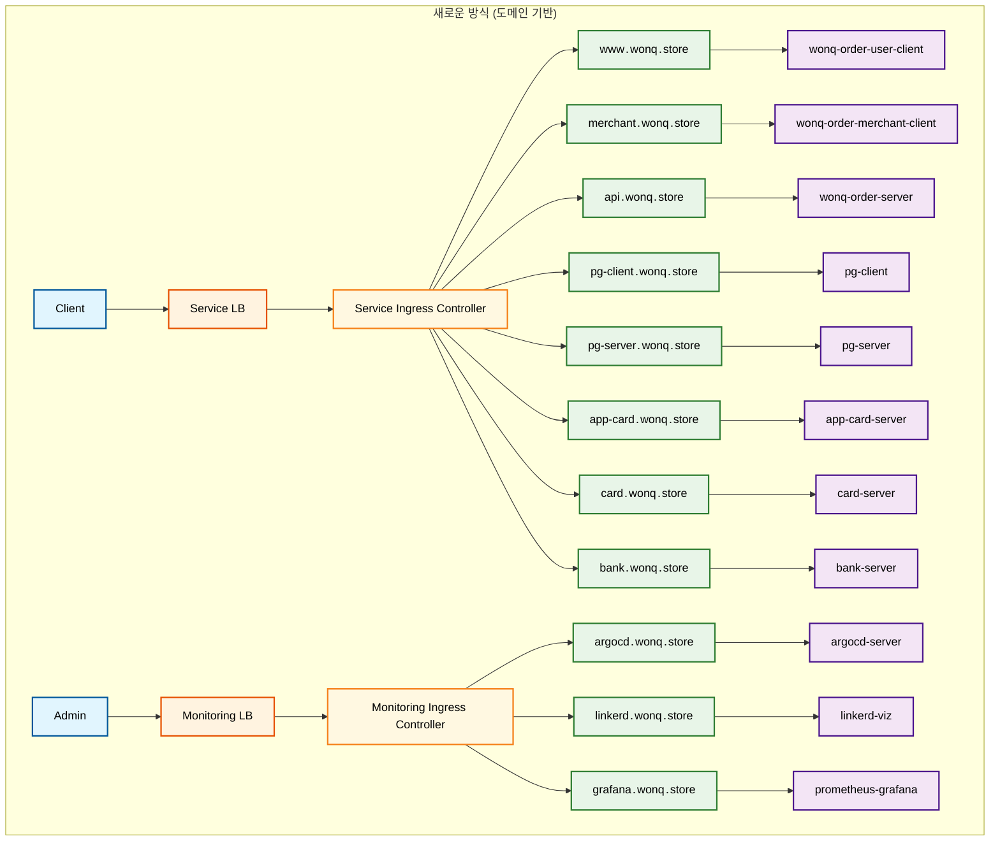
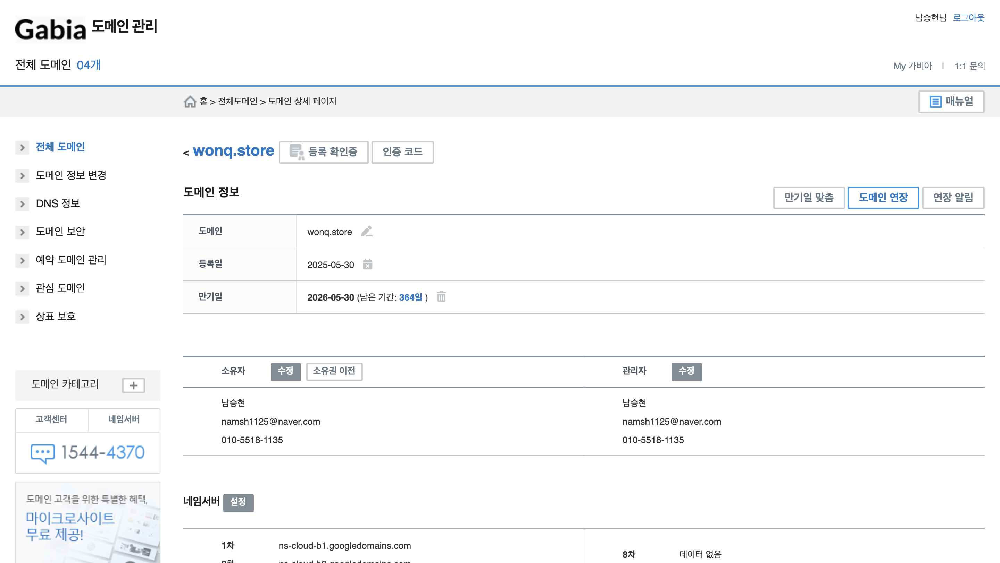
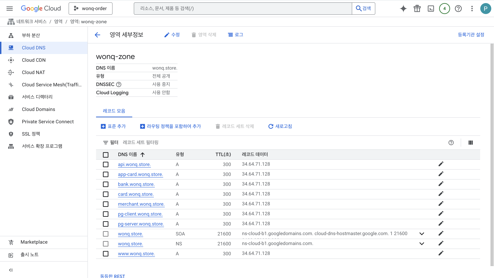

안녕하세요, 원큐 오더 PL 남승현이에요.

오늘은 서비스를 배포하는 과정에서 마주친 quota 초과 문제와 이를 해결하기 위해 **단일 Ingress Controller**로 전환한 과정을 공유하려고 해요.

## 1. 문제 상황: Progressing 상태의 서비스



2025년 5월 29일, ArgoCD로 배포된 서비스를 점검하던 중 **여러 서비스가 Progressing 상태**에 머물러 있는 것을 발견했어요.

```
Error syncing load balancer: failed to ensure load balancer: failed to create forwarding rule for load balancer (ac5f7e82d594c41feb1fddf3adf34370(bank-server/bank-server)): googleapi: Error 403: QUOTA_EXCEEDED - Quota 'IN_USE_ADDRESSES' exceeded. Limit: 8.0 globally.
```

로그를 확인한 결과 위와 같은 오류가 발생하고 있었고, Google Cloud Platform(GCP)의 **IN_USE_ADDRESSES quota를 초과**하며 LoadBalancer를 생성할 수 없다는 것을 알게되었어요.

## 2. 원인 분석: GCP 외부 IP 할당량 초과

아래 명령어를 통해 현재 프로젝트에서 사용 중인 외부 IP를 확인해 보았는데요,

```text
❯ gcloud compute project-info describe --format="json" | jq '.quotas[] | select(.metric == "IN_USE_ADDRESSES")'

{
  "limit": 8.0,
  "metric": "IN_USE_ADDRESSES",
  "usage": 8.0
}
```

```text
❯ kubectl get svc --all-namespaces --field-selector spec.type=LoadBalancer

NAMESPACE                    NAME                         TYPE           CLUSTER-IP       EXTERNAL-IP     PORT(S)                         AGE
app-card-server              app-card-server              LoadBalancer   34.118.231.187   34.47.98.82     8080:32635/TCP                  20h
argocd                       argocd-server                LoadBalancer   34.118.230.171   34.47.105.242   80:30403/TCP,443:31596/TCP      2d13h
bank-server                  bank-server                  LoadBalancer   34.118.226.33    <pending>       9090:30178/TCP                  21h
card-server                  card-server                  LoadBalancer   34.118.228.237   <pending>       8080:32545/TCP                  19h
linkerd-viz                  web                          LoadBalancer   34.118.239.16    34.22.75.162    8084:31237/TCP,9994:31584/TCP   2d13h
monitoring                   prometheus-grafana           LoadBalancer   34.118.227.233   34.47.109.58    80:32214/TCP                    2d5h
pg-client                    pg-client                    LoadBalancer   34.118.232.53    34.22.96.224    443:32508/TCP                   2d12h
pg-server                    pg-server                    LoadBalancer   34.118.237.236   34.64.174.164   443:31697/TCP                   24h
wonq-order-merchant-client   wonq-order-merchant-client   LoadBalancer   34.118.226.16    34.22.100.187   443:31278/TCP                   2d12h
wonq-order-server            wonq-order-server            LoadBalancer   34.118.232.123   <pending>       443:30332/TCP                   2d
wonq-order-user-client       wonq-order-user-client       LoadBalancer   34.118.232.81    34.64.150.238   443:32288/TCP                   2d12h
```

확인해 본 결과, 현재 프로젝트에서 **사용할 수 있는 8개의 IP를 모두 사용하고 있다**는 것을 확인했어요.

## 3. LoadBalancer 서비스를 사용한 이유

이전 [인프라 기술 스택 선택기](../2025-05-23/infrastructure-stack-selection.md) 포스트에서 언급했듯이, 저희는 **실제 환경을 최대한 모방**하고자 했어요.
그래서 각 서비스를 **독립적인 외부 엔드포인트로 접근**하도록 설계했죠.



또한, **도메인을 구매하지 않은 상태**였기 때문에 IP 기반으로 서비스에 접근해야 했어요.

## 4. 해결 방안: 도메인 기반 접근법으로의 전환

그러나 이러한 방식은 **외부 IP 할당량을 초과**하게 되었죠.



그래서 저희는 이 문제를 **단일 Ingress Controller**를 도입하여 해결하기로 했어요.

## 5. 마이그레이션 과정

저희 팀은 도메인 기반 접근 방식으로 전환하기 위해 다음과 같은 단계를 거쳤어요.

### 5-1. 도메인 구매 및 DNS 설정

먼저 **도메인을 구매하고 DNS 설정**을 완료했어요.
도메인은 [가비아](https://www.gabia.com/?utm_source=google-gdn&utm_medium=performanceMax&utm_campaign=%EA%B0%80%EB%B9%84%EC%95%84&utm_term=%EA%B0%80%EB%B9%84%EC%95%84)에서 구매했으며, 
[Google Cloud DNS](https://cloud.google.com/dns?utm_source=google&utm_medium=cpc&utm_campaign=japac-KR-all-en-dr-BKWS-all-lv-trial-PHR-dr-1710102&utm_content=text-ad-none-none-DEV_c-CRE_631194905985-ADGP_Hybrid+%7C+BKWS+-+BRO+%7C+Txt+-Networking-Cloud+DNS-gcp+cloud+DNS-main-KWID_43700076505030106-kwd-1729662906163&userloc_9219195-network_g&utm_term=KW_google+cloud+dns+account&gad_source=1&gad_campaignid=12205783852&gclid=CjwKCAjwruXBBhArEiwACBRtHTXkqfivICKh0UR-DT_08Y7AwKZQFC61Na-8rkvgKjxF_zt4JE9a-hoCrcMQAvD_BwE&gclsrc=aw.ds&hl=ko)를 사용하여 서브도메인과 DNS 레코드를 설정했어요.





### 5-2. Ingress Controller 설치

그 다음으로, 단일 Ingress Controller를 구축하기 위해 **NGINX Ingress Controller를 설치**했어요.

```bash
kubectl apply -f https://raw.githubusercontent.com/kubernetes/ingress-nginx/controller-v1.12.2/deploy/static/provider/cloud/deploy.yaml
```

이 Ingress Controller는 **모든 외부 트래픽을 수신하고, 도메인 기반으로 각 서비스로 라우팅**해요.

### [5-3. 서비스 타입 변경](https://github.com/WON-Q/infra/commit/d35cecd17a9974b93f350675f9bcbafe816b4b20)

세 번째 단계로, 기존 `LoadBalancer` 타입 서비스를 `ClusterIP`로 변경하여 **할당된 외부 IP를 제거**했어요.

```yaml
apiVersion: v1
kind: Service
metadata:
  name: wonq-order-server
  namespace: wonq-order-server
spec:
  type: ClusterIP
  ports:
    - port: 8080
      targetPort: 8080
      name: http
  selector:
    app: wonq-order-server
```

### 5-4. Ingress 리소스 생성

네 번째 단계로, **각 서비스에 대한 Ingress 리소스를 생성하여 도메인 기반 라우팅을 설정**했어요.

Kubernetes의 네임스페이스 격리 특성을 고려해서 **ExternalName 서비스**를 사용하여 [각 서비스에 대한 프록시를 생성](https://github.com/WON-Q/infra/commit/0581e94a998fe7aa70408c63e6e0248da939779d)하였고,

```yaml
apiVersion: v1
kind: Service
metadata:
  name: wonq-order-user-client-proxy
  namespace: default
spec:
  type: ExternalName
  externalName: wonq-order-user-client.wonq-order-user-client.svc.cluster.local
  ports:
    - port: 3000
      targetPort: 3000
```

[Ingress 리소스를 생성하여 도메인 기반 라우팅을 설정](https://github.com/WON-Q/infra/commit/6586f381f867bee985a35efffb9b868908f27f61)했어요.

```yaml
apiVersion: networking.k8s.io/v1
kind: Ingress
metadata:
  name: service-ingress
  namespace: default
  annotations:
    nginx.ingress.kubernetes.io/rewrite-target: /
    nginx.ingress.kubernetes.io/ssl-redirect: "true"
spec:
  ingressClassName: nginx
  rules:
    - host: www.wonq.store
      http:
        paths:
          - path: /
            pathType: Prefix
            backend:
              service:
                name: wonq-order-user-client-proxy
                port:
                  number: 3000
```

## 6. SSL 인증서 설정 과정

마이그레이션을 완료한 후 HTTPS 접속을 위해 SSL 인증서 설정도 진행했어요.

### 6-1. cert-manager 설치

가장 먼저 SSL 인증서를 자동으로 발급받기 위해 **cert-manager를 설치**했어요.
수동으로 인증서를 관리하기엔 서브도메인이 너무 많았거든요.

```bash
kubectl apply -f https://github.com/cert-manager/cert-manager/releases/download/v1.17.2/cert-manager.yaml
```

### [6-2. ClusterIssuer 생성](https://github.com/WON-Q/infra/commit/c9f3b545ea3ac7550e0dbe556d33d95a99af17f1)

그 다음으로, cert-manager가 Let's Encrypt를 통해 인증서를 발급받을 수 있도록 **ClusterIssuer 리소스를 생성**했어요.

```yaml
apiVersion: cert-manager.io/v1
kind: ClusterIssuer
metadata:
  name: letsencrypt-prod
spec:
  acme:
    server: https://acme-v02.api.letsencrypt.org/directory
    email: namsh1125@naver.com
    privateKeySecretRef:
      name: letsencrypt-prod
    solvers:
      - http01:
          ingress:
            class: nginx
```

### 6-3. Ingress에 SSL 설정 추가

마지막으로, 기존 Ingress에 cert-manager 어노테이션과 TLS 섹션을 추가해서 [모든 서브도메인에 대한 SSL 인증서를 한 번에 발급](https://github.com/WON-Q/infra/commit/0fc92021fc25a00711bc24739b13e78c6752942e)받도록 설정했어요.

```yaml title="service-ingress.yaml"
apiVersion: networking.k8s.io/v1
kind: Ingress
metadata:
  name: service-ingress
  namespace: default
  annotations:
    nginx.ingress.kubernetes.io/rewrite-target: /
    nginx.ingress.kubernetes.io/ssl-redirect: "true"
    # highlight-start
    cert-manager.io/cluster-issuer: "letsencrypt-prod" # 추가
    # highlight-end
spec:
  ingressClassName: nginx
  # highlight-start
  tls: # 추가
    - hosts:
        - www.wonq.store
        - merchant.wonq.store
        - api.wonq.store
        # ...모든 서브도메인
      secretName: wonq-store-tls
  # highlight-end
  # ...existing rules...
```

이를 통해 **cert-manager가 자동으로 Let's Encrypt에서 인증서를 발급**받고, **Ingress 리소스에 적용**할 수 있게 되었어요.

### 6-4. 인증서 발급 확인

설정 후 약 2-3분 정도 기다리니까 모든 도메인에 대한 인증서가 자동으로 발급되었어요.

```text
❯ kubectl get certificates

NAME             READY   SECRET           AGE
wonq-store-tls   True    wonq-store-tls   2m
```

## 7. 결과 확인

이제 모든 서비스가 도메인 기반으로 접근 가능해졌어요. 

`www.wonq.store`로 접속하면 `wonq-order-user-client` 서비스로 라우팅되고, 
`merchant.wonq.store`로 접속하면 `wonq-order-merchant-client` 서비스로 라우팅되죠.

```text
❯ curl -I https://www.wonq.store

HTTP/2 200 
date: Fri, 30 May 2025 15:43:15 GMT
content-type: text/html; charset=utf-8
content-length: 13057
x-nextjs-cache: HIT
x-nextjs-prerender: 1
x-nextjs-stale-time: 4294967294
x-powered-by: Next.js
cache-control: s-maxage=31536000
etag: "143o845rycia2l"
vary: Accept-Encoding
strict-transport-security: max-age=31536000; includeSubDomains
```

## 8. 마무리

이번 포스트에서는 GCP의 외부 IP 할당량 문제를 해결하기 위해 **LoadBalancer에서 Ingress Controller로 전환**한 과정을 살펴봤어요.

**도메인 기반 라우팅**을 도입하여 **서비스의 독립성을 유지**하면서도 **9개의 LoadBalancer를 줄이며** 더 효율적이고 확장 가능한 아키텍처로 전환할 수 있었어요.

이 포스트가 비슷한 문제를 겪고 있는 분들에게 도움이 되길 바라며, 추가적인 질문이나 피드백이 있다면 언제든지 문의해 주세요!
